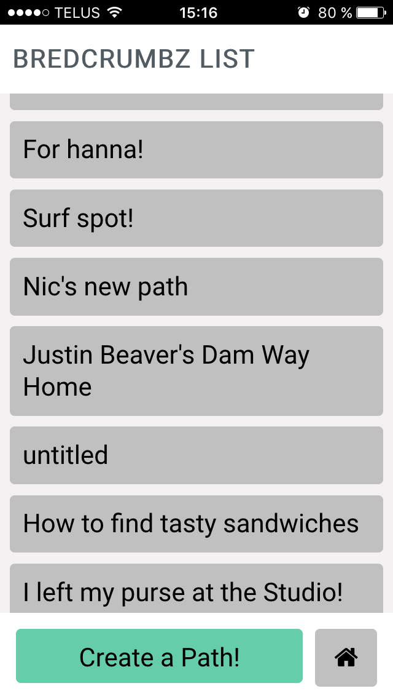
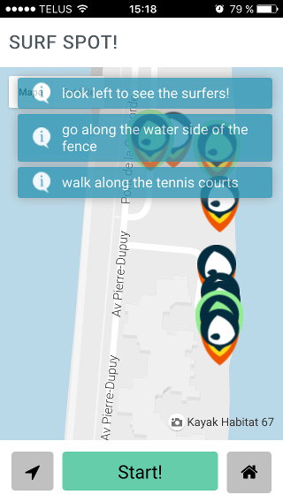
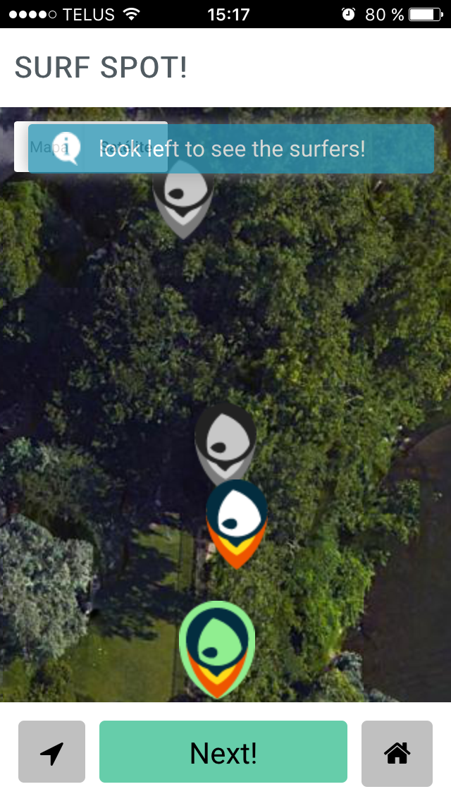

Nic and Hanna Drop BredCrumbz
================================================

A concise central function that creates paths (leaves a trail of breadcrumbs behind you or program manually). With lots of possible applications from the users side and many many extra features coming from the minds of the development team. 

**Example use cases:**

* If you're constantly hunting down your car after a movie or day shopping, set a breadcrumb trail from your spot to the elevators or main entrance of the complex that you can follow back at the end of the day.

* Meeting friends at a festival, an amusement park, on the beach? Send them a path to where you set up camp (have them swing by the concession stand for you too, while you're at it).

* Secret party? Exclusive sale? Pop-up exhibition? Invite your guests with a trail of 'Crumbz or send a path out as a promotional too. 

          
              

**Resources used to begin the coding of this project:**

This repository already contains a base structure to get you started:

* `src`: Source directory that contains all your HTML, CSS and JavaScript code
* `src/index.html`: This will load our application. Since it's an all front-end app, everything happens in here :)
* `src/js`: Will contain your JavaScript code
* `src/css`: Your stylesheet
* `.babelrc`: tells Babel what to transform. In our case, it will transform JSX to React calls, and ES6 to "regular JavaScript"
* `.gitignore`: tells Git to ignore some files. `node_modules` can be installed with NPM
* `package.json`: contains the project dependencies as well as some scripts that we can `npm run`
* `README.md`: This file ;)
* `server.js`: Runs a tiny web server that always sends `index.html` by default
* `webpack.config.js`: Configuration for Webpack

To start hacking on this project:

1. `npm install`
2. Start the server and Webpack with `npm start`
3. Start coding!

**Base structure**
Our application will be built to run in the browser. This means we will not be needing our own server nor database. However, **we need to serve our files somewhere**. For this reason, a tiny web server was created at `server.js`. All you have to do is run it with `node server.js`. You should not need to restart it nor modify it.